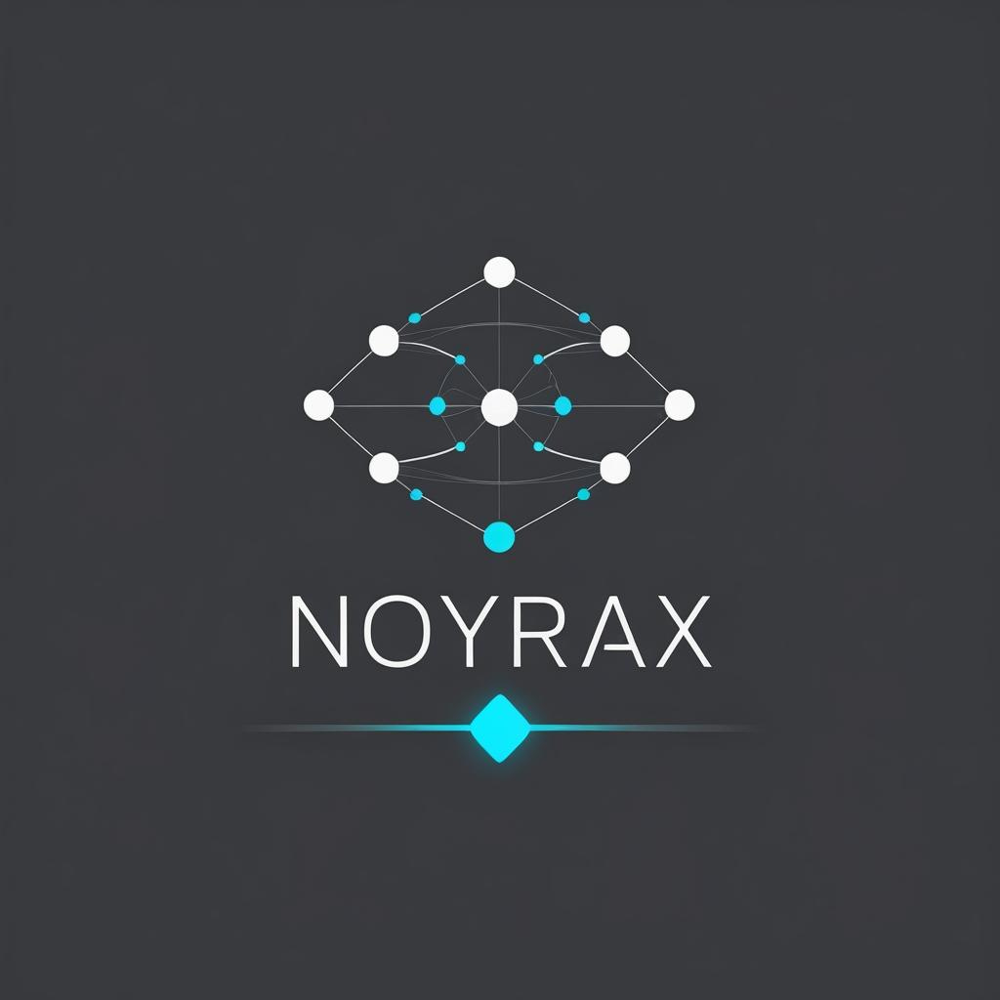

<p align="center">
  
</p>

<h1 align="center">Noyrax</h1>

<p align="center">
  <strong>Documentation that never drifts.</strong><br>
  Automatische Dokumentationsgenerierung mit Validierung und Drift-Detection für moderne Entwicklungsteams.
</p>

<p align="center">
  <a href="https://github.com/noyrax/noyrax/actions/workflows/ci.yml"></a>
  <a href="https://github.com/noyrax/noyrax"></a>
  <a href="https://github.com/noyrax/noyrax/stargazers"></a>
  <a href="LICENSE"></a>
</p>

<p align="center">
  <a href="#features">Features</a> •
  <a href="#quick-start">Quick Start</a> •
  <a href="#usage">Usage</a> •
  <a href="#ai-integration">AI Integration</a> •
  <a href="#mehrdimensionaler-navigationsraum">Navigationsraum</a> •
  <a href="#pricing">Pricing</a> •
  <a href="#contributing">Contributing</a>
</p>

<p align="center">
  <strong>Version 1.0.4</strong> • 
  <a href="docs/adr/">Architecture Decision Records</a> • 
  <a href="CONTRIBUTING.md">Contributing</a>
</p>

---

## Das Problem

> **80% der Dokumentation ist veraltet.** Entwickler ändern Code, aber nicht die Docs. Reviews fangen es nicht auf. CI prüft es nicht.

Noyrax löst das:

```diff
- ❌ Manuelle Docs → veralten sofort
- ❌ TypeDoc/JSDoc → keine Validierung
- ❌ "Docs later" → passiert nie

+ ✅ Automatische Generierung aus Code
+ ✅ Drift-Detection bei jeder Änderung
+ ✅ CI/CD-Integration mit Merge-Blocking
```

---

## Features

<table>
<tr>
<td width="33%">

### 🔄 Auto-Generate

Generiert Markdown-Dokumentation aus Code – deterministisch und reproduzierbar.

- TypeScript/JavaScript
- Python
- JSON/YAML Configs
- Multi-Language Support

</td>
<td width="33%">

### 🛡️ Drift-Detection

Erkennt automatisch, wenn Code und Dokumentation auseinanderlaufen.

- Signatur-Validierung
- Coverage-Metriken
- Change-Tracking
- Inkrementelle Updates

</td>
<td width="33%">

### 🤖 AI-Native

Built for Cursor, Copilot & Claude mit MCP-Server und strukturierten Workflows.

- MCP-Server Integration (99 Resources)
- Impact-Analyse
- ADR-Generierung
- Cursor Rules

</td>
</tr>
<tr>
<td width="33%">

### 🧠 Semantische Intelligenz

Rollenbasierte Dokumentationstiefe und intelligente Signatur-Formatierung.

- **SignatureFormatter** ([ADR-020](docs/adr/020-api-doc-tiefe-und-signatureformatter.md)): Zentrale Signatur-Formatierung
- **SymbolClassifier** ([ADR-021](docs/adr/021-semantic-api-docs-and-symbol-classifier.md)): Rollenbasierte Klassifizierung (service-api, domain-model, config, infra, other)
- **Semantisches Rendering** ([ADR-022](docs/adr/022-semantic-class-and-constants-rendering.md)): Strukturierte Klassen- und Konstanten-Darstellung

</td>
<td width="33%">

### 🗺️ Mehrdimensionaler Navigationsraum

Koordinaten-System mit 5 Dimensionen für KI-Agenten-Navigation.

- **Modul-Raum (X)**: API-Dokumentation pro Datei
- **Symbol-Raum (Y)**: Symbole mit Dependencies
- **Beziehungs-Raum (Z)**: Modul-Abhängigkeiten
- **Wissens-Raum (W)**: Architektur-Entscheidungen (ADRs)
- **Zeit-Raum (T)**: Änderungen über die Zeit (ADR-024)

</td>
<td width="33%">

### ✅ Reality-Driven Development

Verification-Loops verhindern AI-Agent-Halluzinationen.

- **Verification-Scripts** ([ADR-026](docs/adr/026-reality-driven-development-system.md)): Architektur, ADRs, Imports
- **Pre-Commit Hooks**: Automatische Verification
- **CI/CD Integration**: GitHub Actions für Reality-Checks
- **Evidence-basierte Claims**: Code ist die einzige Wahrheitsquelle

</td>
</tr>
</table>

---

## Quick Start

### Via npm (Recommended for CLI Tools)

```bash
npm install -g @noyrax/documentation-system-plugin
```

**Available CLI Tools:**
- `noyrax-scan` - Scan codebase for documentation
- `noyrax-validate` - Validate documentation consistency
- `noyrax-generate` - Generate documentation
- `noyrax-verify-adrs` - Verify ADR claims against code
- `noyrax-verify-architecture` - Verify architecture rules
- `noyrax-verify-imports` - Verify import availability
- `noyrax-verify-all` - Run all verification checks

**Example:**
```bash
# Scan codebase
noyrax-scan

# Generate documentation
noyrax-generate

# Validate documentation
noyrax-validate

# Verify ADRs
noyrax-verify-adrs
```

### Via VS Code Extension

### Option 1: VS Code Extension

```bash
# Extension installieren
code --install-extension noyrax.noyrax

# Oder über VS Code Marketplace suchen: "Noyrax"
```

### Option 2: CLI (für CI/CD)

```bash
# Global installieren
npm install -g @noyrax/cli

# Oder als Dev-Dependency
npm install -D @noyrax/cli

# Projekt für Noyrax vorbereiten (.cursor/rules + mcp.json)
npx noyrax init

# Später Rules aktualisieren
npx noyrax update

# Installation prüfen
npx noyrax info

# Hinweis:
# Die eigentliche Pipeline (Scan → Generate → Validate)
# läuft heute über die VS Code Extension bzw. den MCP-Server,
# nicht direkt über das CLI.
```

### Option 3: Mit AI-Agent (Cursor)

```bash
# Cursor Rules & MCP-Konfiguration initialisieren
npx noyrax init

# Projekt in Cursor öffnen
# - Die .cursor/rules werden automatisch geladen
# - Der MCP-Server \"doc-validation\" steht zur Verfügung

# In Cursor/VS Code:
# - Noyrax-Extension installieren
# - MCP-Tools verwenden:
#   validation/runScan
#   validation/runValidate
#   validation/runDriftCheck
#   validation/analyzeImpact
```

---

## Usage

### VS Code Commands

| Command | Shortcut | Beschreibung |
|---------|----------|--------------|
| `Noyrax: Scan` | `Ctrl+Shift+N S` | Projekt scannen |
| `Noyrax: Generate` | `Ctrl+Shift+N G` | Docs generieren |
| `Noyrax: Validate` | `Ctrl+Shift+N V` | Validierung ausführen |
| `Noyrax: Full Cycle` | `Ctrl+Shift+N F` | Scan → Generate → Validate |

### CLI Commands

- `npx noyrax init` – Projekt für Noyrax vorbereiten (`.cursor/rules/` + `mcp.json`)
- `npx noyrax update` – Rules auf die neueste Version bringen
- `npx noyrax info` – Versionen und enthaltene Rules anzeigen

> **Hinweis:** Befehle wie `noyrax scan`, `noyrax generate`, `noyrax validate`, `noyrax drift` oder `noyrax impact`
> sind in der aktuellen Version noch nicht als CLI-Unterbefehle implementiert.
> Die entsprechenden Funktionen stehen über die VS Code Extension und die MCP-Tools
> (`validation/runScan`, `validation/runValidate`, `validation/runDriftCheck`, `validation/analyzeImpact`) zur Verfügung.

### Konfiguration

Erstelle `noyrax.config.json` im Projekt-Root:

```json
{
  "include": ["src/**/*.ts", "lib/**/*.ts"],
  "exclude": ["**/*.test.ts", "**/*.spec.ts", "node_modules/**"],
  "output": {
    "modules": "docs/modules",
    "system": "docs/system",
    "index": "docs/index"
  },
  "validation": {
    "coverage": {
      "classes": 0.9,
      "functions": 0.8,
      "interfaces": 0.9
    },
    "blockOnDrift": true
  }
}
```

---

## AI Integration

Noyrax ist **AI-native** – designed für die Zusammenarbeit mit Cursor, Copilot und anderen AI-Assistenten.

### MCP-Server (ADR-025)

Der MCP-Server ermöglicht strukturierte Kommunikation zwischen AI-Agent und Noyrax:

**99 Resources verfügbar:**
- **4 System-Resources**: `docs://system/graph`, `docs://system/dependencies`, `docs://system/changes`, `docs://index/symbols.jsonl`
- **71 Modul-Resources**: `docs://modules/{path}` (dynamisch geladen)
- **24 ADR-Resources**: `docs://adr/{name}` (dynamisch geladen)

**Tools (CLI-Bridge-Pattern):**
```typescript
validation/runScan        // Scan via npm run scan:cli
validation/runValidate    // Validate via npm run validate:cli
validation/runDriftCheck  // Drift erkennen
validation/analyzeImpact  // Impact-Analyse via Symbol-Index
```

### Cursor Rules

Noyrax liefert vorgefertigte `.cursor/rules/` für strukturierte Workflows:

```
├── 000-orchestrator.mdc      # Zentrale Workflow-Steuerung
├── 001-pre-check.mdc         # Pflichtschritte vor Änderungen
├── 002-system-context.mdc    # Mehrdimensionaler Navigationsraum
├── 020-validate-workflow.mdc # Validierungs-Workflow
├── 021-impact-analysis.mdc   # Impact-Analyse
├── 026-reality-driven-verification.mdc # Verification-Loops
└── 030-constraints.mdc       # Architektur-Constraints
```

### Workflow-Beispiel

```
1. Agent liest Docs vor Änderung (Pre-Check, Systemkontext)
2. Agent ändert max. 3 Dateien
3. Agent ruft validation/runValidate auf
4. Bei Drift → Agent korrigiert
5. Bei signifikanter Änderung → ADR generieren
6. Verification-Scripts prüfen Reality (Pre-Commit Hook)
```

### Reality-Driven Development ([ADR-026](docs/adr/026-reality-driven-development-system.md))

**Grundprinzip:** Code ist die einzige Wahrheitsquelle. Dokumentation und ADRs können veraltet sein.

**Verification-Loops:**
- **Vor Implementierung:** Reality-Check (Dateien, Funktionen, Imports verifizieren)
- **Während Implementierung:** Incremental Verification (sofort kompilieren, sofort testen)
- **Nach Implementierung:** End-to-End Verification (`npm run verify:all`)

**Verification-Scripts:**
- `scripts/verify-architecture.js` - Architektur-Regeln prüfen
- `scripts/verify-adrs.js` - ADR-Claims gegen Code prüfen
- `scripts/verify-imports.js` - Import-Verfügbarkeit prüfen

**Automation:**
- Pre-Commit Hook (`.husky/pre-commit`)
- GitHub Actions (`.github/workflows/verification.yml`)
- VS Code Tasks (`.vscode/tasks.json`)

---

## Mehrdimensionaler Navigationsraum (ADR-024)

Noyrax generiert ein **Koordinaten-System** mit 5 Dimensionen, das KI-Agenten ermöglicht, sich im Code-Raum zu bewegen:

| Dimension | Artefakt | Funktion | MCP-Server Resource |
|-----------|----------|----------|---------------------|
| **Modul-Raum (X)** | `docs/modules/*.md` | API-Dokumentation pro Datei | `docs://modules/{path}` |
| **Symbol-Raum (Y)** | `docs/index/symbols.jsonl` | Symbole mit Dependencies | `docs://index/symbols.jsonl` |
| **Beziehungs-Raum (Z)** | `docs/system/DEPENDENCY_GRAPH.md` | Modul-Abhängigkeiten | `docs://system/graph` |
| **Wissens-Raum (W)** | `docs/adr/*.md` | Architektur-Entscheidungen (Landkarte) | `docs://adr/{name}` |
| **Zeit-Raum (T)** | `docs/system/CHANGE_REPORT.md` | Änderungen über die Zeit | `docs://system/changes` |

### Navigation-Beispiel für KI-Agenten

```typescript
// 1. Modul-Dokumentation lesen (Modul-Raum)
const moduleDoc = await readDocsResource('docs://modules/src__parsers__ts-js.ts.md');

// 2. Dependency-Graph abrufen (Beziehungs-Raum)
const graph = await readDocsResource('docs://system/graph');

// 3. Change Report abrufen (Zeit-Raum)
const changes = await readDocsResource('docs://system/changes');

// 4. ADRs lesen (Wissens-Raum)
const adrs = await readDocsResource('docs://adr/020-api-doc-tiefe-und-signatureformatter.md');

// 5. Impact-Analyse durchführen
const impact = await analyzeImpact({
  file: 'src/parsers/ts-js.ts',
  symbol: 'TsJsParser'
});
```

### ADR-Verknüpfung (ADR-023)

Module zeigen automatisch relevante ADRs:
- **Module → ADR**: Welche Architektur-Entscheidungen betreffen dieses Modul?
- **ADR → Module**: Welche Module implementieren diese Entscheidung?

---

## Output-Struktur

Noyrax generiert eine deterministische Dokumentationsstruktur:

```
docs/
├── modules/           # Pro-Datei Dokumentation (Modul-Raum)
│   ├── src__core__scanner.ts.md
│   ├── src__parser__typescript.ts.md
│   └── ...
│   # Enthält: API-Signaturen, ADR-Links, semantisches Rendering
├── system/            # System-weite Übersichten
│   ├── DEPENDENCIES.md        # Import-Übersicht pro Modul
│   ├── DEPENDENCY_GRAPH.md    # Mermaid-Graph (Beziehungs-Raum)
│   └── CHANGE_REPORT.md       # Änderungsprotokoll (Zeit-Raum)
├── index/             # Schneller Symbol-Index (Symbol-Raum)
│   └── symbols.jsonl  # Symbole mit Dependencies (JSONL-Format)
└── adr/               # Architecture Decision Records (Wissens-Raum)
    ├── 020-api-doc-tiefe-und-signatureformatter.md
    ├── 021-semantic-api-docs-and-symbol-classifier.md
    ├── 022-semantic-class-and-constants-rendering.md
    ├── 023-adr-verknuepfung-modul-doku.md
    ├── 024-cursor-rules-mehrdimensionaler-raum.md
    ├── 025-mcp-tools-scan-validate-cli-bridge.md
    ├── 026-reality-driven-development-system.md
    ├── 027-scanner-excludes-and-union-logic-fix.md
    └── ...
```

### Modul-Dokumentation Features

Jede Modul-Dokumentation (`docs/modules/*.md`) enthält:

- **API-Signaturen**: Formatierung via SignatureFormatter ([ADR-020](docs/adr/020-api-doc-tiefe-und-signatureformatter.md))
- **Semantische Klassifizierung**: Rollenbasierte Doku-Tiefe via SymbolClassifier ([ADR-021](docs/adr/021-semantic-api-docs-and-symbol-classifier.md))
- **Semantisches Rendering**: Strukturierte Klassen- und Konstanten-Darstellung ([ADR-022](docs/adr/022-semantic-class-and-constants-rendering.md))
- **ADR-Verknüpfungen**: Automatische Links zu relevanten Architektur-Entscheidungen (ADR-023)

### Change Report (Zeit-Raum)

Der Change Report (`docs/system/CHANGE_REPORT.md`) zeigt:
- Neu hinzugefügte Symbole
- Geänderte Signaturen
- Dependency-Änderungen
- Ermöglicht Änderungsmuster zu erkennen

---

## CI/CD Integration

### GitHub Actions

```yaml
name: Noyrax Validation

on: [push, pull_request]

jobs:
  validate-docs:
    runs-on: ubuntu-latest
    steps:
      - uses: actions/checkout@v4
      
      - name: Setup Node.js
        uses: actions/setup-node@v4
        with:
          node-version: '20'
          
      - name: Install Dependencies
        run: npm ci
        
      - name: Run Noyrax
        uses: noyrax/action@v1
        with:
          command: validate
          fail-on-drift: true
          
      - name: Comment PR
        if: github.event_name == 'pull_request'
        uses: noyrax/action@v1
        with:
          command: comment
          github-token: ${{ secrets.GITHUB_TOKEN }}
```

### Pre-commit Hook

```bash
# .husky/pre-commit
npx noyrax validate --quick
```

---

## Pricing

<table>
<tr>
<th width="25%">Free</th>
<th width="25%">Pro</th>
<th width="25%">Team</th>
<th width="25%">Enterprise</th>
</tr>
<tr>
<td><h3>$0</h3><small>forever</small></td>
<td><h3>$19</h3><small>/month</small></td>
<td><h3>$49</h3><small>/seat/month</small></td>
<td><h3>Custom</h3><small>contact us</small></td>
</tr>
<tr>
<td>

✅ VS Code Extension<br>
✅ CLI & MCP-Server<br>
✅ Local Drift-Detection<br>
✅ Unlimited Projects<br>

</td>
<td>

Everything in Free, plus:<br><br>
✅ Cloud Dashboard<br>
✅ Email Drift-Alerts<br>
✅ Priority Support<br>
✅ Custom Themes<br>

</td>
<td>

Everything in Pro, plus:<br><br>
✅ Team Analytics<br>
✅ Slack/Teams Integration<br>
✅ Shared Configurations<br>
✅ Role-based Access<br>

</td>
<td>

Everything in Team, plus:<br><br>
✅ SSO / SAML<br>
✅ Audit Logs<br>
✅ Compliance Reports<br>
✅ Dedicated Support<br>

</td>
</tr>
</table>

---

## Supported Languages

| Language | Status | Features |
|----------|--------|----------|
| TypeScript/JavaScript | ✅ Full | Classes, Functions, Interfaces, Types |
| Python | ✅ Full | Classes, Functions, Decorators |
| JSON/YAML | ✅ Full | Schema extraction |
| Markdown | ✅ Full | Frontmatter, Links |
| Go | 🚧 Beta | Functions, Structs |
| Rust | 📋 Planned | Coming Q1 2026 |
| Java/Kotlin | 📋 Planned | Coming Q2 2026 |

---

## Strategische Vision

- **[`../../VISION.md`](../../VISION.md)** - Vision: Autonome KI-gesteuerte Softwareentwicklung
- **[`../../INNOVATION_ANALYSIS.md`](../../INNOVATION_ANALYSIS.md)** - Innovations-Analyse: Was macht das System besonders?
- **[`../../PROBLEM_SOLUTION_MAPPING.md`](../../PROBLEM_SOLUTION_MAPPING.md)** - Problem-Lösung-Mapping
- **[`../../AI_CODING_IMPLICATIONS.md`](../../AI_CODING_IMPLICATIONS.md)** - AI-Coding Implications
- **[`../../BUSINESS_IMPACT.md`](../../BUSINESS_IMPACT.md)** - Business Impact: Kosteneinsparungen
- **[`../../QUALITY_IMPROVEMENT.md`](../../QUALITY_IMPROVEMENT.md)** - Qualitätsverbesserung
- **[`../../DOMAIN_TRANSFERABILITY.md`](../../DOMAIN_TRANSFERABILITY.md)** - Domänen-Transferfähigkeit

## Contributing

Contributions sind willkommen! Siehe [CONTRIBUTING.md](CONTRIBUTING.md) für Details.

```bash
# Repository klonen
git clone https://github.com/noyrax/noyrax.git
cd noyrax

# Dependencies installieren
npm install

# Development Build
npm run compile

# Tests ausführen
npm test

# Extension testen (F5 in VS Code)
```

### Development Workflow

1. Issue erstellen oder existierendes Issue übernehmen
2. Branch erstellen: `git checkout -b feature/my-feature`
3. Änderungen implementieren (max. 3 Dateien pro Commit)
4. Tests schreiben und ausführen
5. `npm run validate` ausführen
6. Pull Request erstellen

---

## Roadmap

- [x] **v1.0** – Core: Scan, Generate, Validate
- [x] **v1.1** – Inkrementelle Generierung
- [x] **v1.2** – MCP-Server & Cursor Rules
- [x] **v1.0.4** – Semantische Intelligenz & Mehrdimensionaler Raum
  - SignatureFormatter & SymbolClassifier ([ADR-020](docs/adr/020-api-doc-tiefe-und-signatureformatter.md), [ADR-021](docs/adr/021-semantic-api-docs-and-symbol-classifier.md))
  - Semantisches Rendering ([ADR-022](docs/adr/022-semantic-class-and-constants-rendering.md))
  - ADR-Linking (ADR-023)
  - Mehrdimensionaler Navigationsraum (ADR-024)
  - MCP-Server CLI-Bridge (ADR-025)
  - Reality-Driven Development ([ADR-026](docs/adr/026-reality-driven-development-system.md))
  - Scanner-Excludes Fix ([ADR-027](docs/adr/027-scanner-excludes-and-union-logic-fix.md))
- [ ] **v1.3** – GitHub Action (Q1 2026)
- [ ] **v1.4** – Cloud Dashboard (Q2 2026)
- [ ] **v2.0** – Team Features (Q3 2026)

---

## Architecture

```
┌─────────────────────────────────────────────────────────────┐
│                        Noyrax                               │
├─────────────────────────────────────────────────────────────┤
│                                                             │
│  ┌──────────────┐  ┌──────────────┐  ┌──────────────┐      │
│  │   Scanner    │  │  Generator   │  │  Validator   │      │
│  │              │  │              │  │              │      │
│  │  - File I/O  │  │  - Markdown  │  │  - Drift     │      │
│  │  - Git Diff  │  │  - Templates │  │  - Coverage  │      │
│  │  - Parsers   │  │  - Index     │  │  - Reports   │      │
│  └──────────────┘  └──────────────┘  └──────────────┘      │
│         │                 │                 │               │
│         └─────────────────┼─────────────────┘               │
│                           │                                 │
│                    ┌──────────────┐                         │
│                    │    Cache     │                         │
│                    │  - AST       │                         │
│                    │  - Signatures│                         │
│                    │  - Output    │                         │
│                    │  - Dependencies│                       │
│                    └──────────────┘                         │
│                           │                                 │
│                    ┌──────────────┐                         │
│                    │     Core     │                         │
│                    │  - Signature │                         │
│                    │    Formatter │                         │
│                    │  - Symbol    │                         │
│                    │    Classifier│                         │
│                    │  - ADR       │                         │
│                    │    Linker    │                         │
│                    └──────────────┘                         │
│                                                             │
├─────────────────────────────────────────────────────────────┤
│  Mehrdimensionaler Navigationsraum (5 Dimensionen)        │
│  Modul-Raum │ Symbol-Raum │ Beziehungs-Raum │             │
│  Wissens-Raum │ Zeit-Raum                                  │
├─────────────────────────────────────────────────────────────┤
│  Integrations:  VS Code │ CLI │ MCP Server │ GitHub Action │
│  Verification: Pre-Commit │ CI/CD │ VS Code Tasks         │
└─────────────────────────────────────────────────────────────┘
```

---

## License

MIT © [Benjamin Behrens](https://github.com/benjamin-behrens)

---

<p align="center">
  <sub>Built with ❤️ for developers who care about documentation.</sub>
</p>
