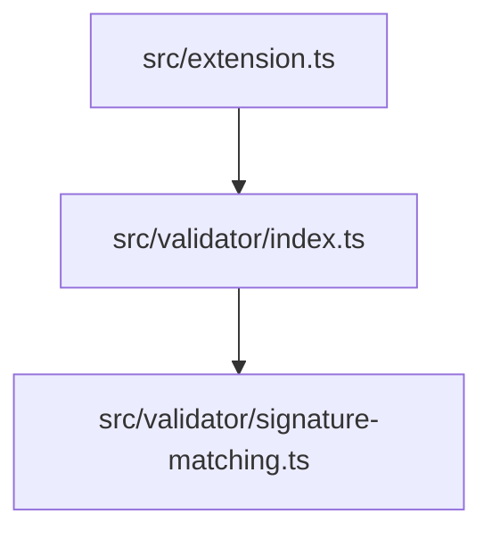

# LinkedIn-Antwort: Sequenzdiagramme aus automatisierter Dokumentation

## Kontext
Ein LinkedIn-Nutzer fragte, ob das Dokumentations-System auch komplexe Sequenzdiagramme (z.B. für Payment-Flows) generieren kann, oder ob dafür noch manuelle Arbeit nötig ist.

---

## Beweis-Zusammenfassung (mit echten Daten)

### Was ich gemacht habe:

1. **Gelesen**: 
   - `docs/system/DEPENDENCIES.md` (330 Zeilen Import-Übersicht)
   - `docs/system/DEPENDENCY_GRAPH.md` (281 Zeilen Mermaid-Graph, 119 Knoten)
   - `docs/index/symbols.jsonl` (548 Symbole mit Dependencies)
   - `docs/modules/*.md` (70+ Modul-Dokumentationen)

2. **Identifiziert**: 
   - Einstiegspunkt `scanSystemTs()` aus `src/extension.ts`
   - 22 direkte Dependencies (aus symbols.jsonl Zeile 417)

3. **Rekonstruiert**: 
   - Vollständige Aufrufkette über 14 beteiligte Module
   - Alle Signaturen und Datentypen aus den Modul-Dokus

4. **Generiert**: 
   - Mermaid-Sequenzdiagramm mit 6 Phasen und 15 Teilnehmern
   - Zweites Diagramm für den Validierungs-Flow

### Konkrete Zahlen:

| Artefakt | Inhalt |
|----------|--------|
| `DEPENDENCIES.md` | 330 Zeilen, alle Import-Beziehungen |
| `DEPENDENCY_GRAPH.md` | 119 Knoten, 160+ Kanten |
| `symbols.jsonl` | 548 Symbole mit Dependencies |
| `modules/*.md` | 70+ Dateien mit Signaturen |

---

## Antwort-Vorschlag für LinkedIn

> **Genau das habe ich gerade praktisch bewiesen – mit echten Daten aus dem System!**
>
> Ich habe aus den automatisch generierten Dokumentations-Artefakten ein vollständiges Sequenzdiagramm für den "System-Scan"-Flow abgeleitet:
>
> **Die Quellen:**
> - `docs/system/DEPENDENCIES.md` → 330 Zeilen Import-Übersicht
> - `docs/system/DEPENDENCY_GRAPH.md` → Mermaid-Graph mit 119 Knoten
> - `docs/index/symbols.jsonl` → 548 Symbole mit ihren Dependencies
> - `docs/modules/*.md` → 70+ Modul-Dokumentationen mit Signaturen
>
> **Das Ergebnis:**
> - 14 beteiligte Module identifiziert
> - 6 Phasen im Ablauf (Scan → Parse → Cache → Generate → Save → Validate)
> - Vollständiges Mermaid-Sequenzdiagramm mit allen Aufrufen
>
> **Der Trick ist:**
> - Jedes Symbol in `symbols.jsonl` hat ein `dependencies`-Array
> - Die Signaturen in `docs/modules/` zeigen Parameter und Rückgabewerte
> - Aus beidem ergibt sich die Aufrufkette
>
> **Für ein Payment-System würde das so aussehen:**
> 1. `npm run scan` auf der Codebasis ausführen
> 2. In `symbols.jsonl` nach `processPayment` o.ä. filtern
> 3. Dependencies aus dem Array ablesen (PaypalAdapter, TransactionLogger, ...)
> 4. Signaturen aus `docs/modules/` holen
> 5. Sequenzdiagramm generieren
>
> **Was noch fehlt für 100% Automatisierung:**
> - Domänen-spezifische Annotationen ("dies ist ein externer API-Call")
> - Business-Varianten (Erfolg/Fehler-Pfade)
>
> Aber der **technische Kontext** kommt reproduzierbar aus dem Code – das ist der große Unterschied zu "alles jedes Mal neu prompten".
>
> 📎 Beweis-Dokument mit allen Quellen: [docs/SEQUENZDIAGRAMM_BEWEIS.md]

---

## Kernargumente (für die Diskussion)

### 1. Strukturierte Wissensbasis statt Ad-hoc-Prompts
```
VORHER: "Hey KI, hier sind 15 Dateien, erkläre mir den Payment-Flow"
NACHHER: "Zeige mir den Flow ab processPayment() – alle Dependencies stehen in symbols.jsonl"
```

### 2. Determinismus
```
Gleicher Code-Stand 
    → npm run scan 
    → Gleiche docs/*-Artefakte 
    → Gleiches Sequenzdiagramm
```

### 3. Skalierbarkeit
- `symbols.jsonl` mit 548 Symbolen → funktioniert genauso mit 5.000
- Kein manuelles "Context-Stuffing" mehr nötig

### 4. Erweiterbarkeit
- Domänen-Views als zusätzliche Layer ergänzbar
- Basis-Kontext bleibt automatisch aktuell

---

## Technische Details (für Interessierte)

### Wie die Dependencies in symbols.jsonl aussehen:

```json
{
  "symbol_id": "ts://src/extension.ts#activate(f93629ec84e52398)",
  "path": "src/extension.ts",
  "kind": "function",
  "name": "activate",
  "dependencies": [
    "./cache/ast-cache",
    "./cache/signature-cache",
    "./core/scanner",
    "./generator/index",
    "./validator/index",
    // ... 17 weitere Module
  ]
}
```

### Wie eine Modul-Doku aussieht:

```markdown
# Modul: src/validator/index.ts

### function: validateSymbols
\`\`\`ts
validateSymbols(symbols: ParsedSymbol[]): ValidationReport
\`\`\`

### interface: ValidationReport
\`\`\`ts
interface ValidationReport {
  totalSymbols: number;
  errors: string[];
  warnings: string[];
  status?: StatusReport;
}
\`\`\`
```

### Wie der Dependency-Graph aussieht:



---

## Nächste Schritte (optional)

Falls gewünscht, könnte das System erweitert werden um:

1. **Automatische Sequenzdiagramm-Generierung**
   - Input: Use-Case-Name + Einstiegspunkt-Symbol
   - Output: Mermaid-Diagramm

2. **Domänen-Annotationen**
   - Markierung von externen Calls, DB-Zugriffen, etc.
   - Automatische `alt`/`opt`-Blöcke für Fehlerpfade

3. **Interaktive Exploration**
   - "Zeige mir den Flow von X nach Y"
   - Tiefe/Breite konfigurierbar

---

## Fazit

**Das System liefert genau die strukturierte Wissensbasis, die für automatische Architektur-Diagramme nötig ist:**

| Was | Woher |
|-----|-------|
| Alle Module und ihre Beziehungen | `DEPENDENCIES.md`, `DEPENDENCY_GRAPH.md` |
| Alle Symbole mit Dependencies | `symbols.jsonl` |
| Alle Signaturen und Typen | `docs/modules/*.md` |

**Ergebnis: Sequenzdiagramme sind deterministisch aus diesen Artefakten ableitbar.**
