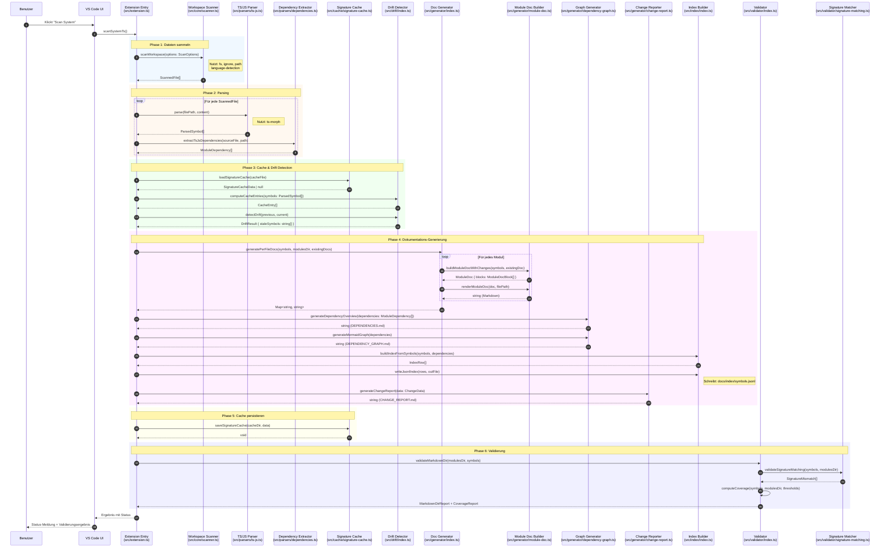

# Beweis: Sequenzdiagramme aus docs/index, docs/modules und docs/system ableiten

Dieses Dokument beweist, dass aus den automatisch generierten Dokumentations-Artefakten (`docs/index`, `docs/modules`, `docs/system`) vollständige Sequenzdiagramme für beliebige Abläufe im System abgeleitet werden können.

---

## 1. Gewählter Use Case: "Dokumentations-Scan-Flow"

### 1.1 Use Case Definition
**Ablauf**: Ein Benutzer führt den VS Code-Befehl "Scan System" aus, um die gesamte Codebasis zu scannen und Dokumentation zu generieren.

### 1.2 Einstiegspunkt (aus `docs/modules/src__extension.ts.md`)
```ts
// Quelle: docs/modules/src__extension.ts.md, Zeile 137-139
function scanSystemTs(): any
```

### 1.3 Einstiegspunkt mit Dependencies (aus `docs/index/symbols.jsonl`)
```json
// Zeile 417 aus symbols.jsonl
{
  "symbol_id": "ts://src/extension.ts#activate(f93629ec84e52398)",
  "path": "src/extension.ts",
  "kind": "function",
  "name": "activate",
  "dependencies": [
    "./cache/ast-cache",
    "./cache/dependencies-cache",
    "./cache/output-cache",
    "./cache/signature-cache",
    "./core/async",
    "./core/consolidation",
    "./core/git",
    "./core/scanner",
    "./drift/index",
    "./generator/change-report",
    "./generator/dependency-graph",
    "./generator/index",
    "./index/index",
    "./parsers/dependencies",
    "./parsers/json-yaml",
    "./parsers/python",
    "./parsers/ts-js",
    "./parsers/types",
    "./ui/commands-provider",
    "./ui/status-bar",
    "./validator/index",
    "./validator/status",
    "fs", "path", "vscode"
  ]
}
```

---

## 2. Beteiligte Module aus `docs/system/DEPENDENCIES.md`

### 2.1 Direkte Abhängigkeiten von `src/extension.ts` (Zeilen 213-241)

```markdown
## src/extension.ts

### Imports
- `./cache/ast-cache` (computeFileHash, loadAstHashCache, saveAstHashCache)
- `./cache/dependencies-cache` (loadDependenciesCache, saveDependenciesCache)
- `./cache/output-cache` (computeContentHash, loadOutputHashCache, saveOutputHashCache)
- `./cache/signature-cache` (loadSignatureCache, saveSignatureCache)
- `./core/async` (mapLimit)
- `./core/consolidation` (buildDependenciesUnion, buildDependenciesUnionWithDebug, buildSymbolsUnion, UnionDebugInfo)
- `./core/git` (getChangedFiles, getDeletedFiles)
- `./core/scanner` (scanWorkspace)
- `./drift/index` (computeCacheEntries, detectDrift)
- `./generator/change-report` (extractChangesFromModuleDocs, generateChangeReport)
- `./generator/dependency-graph` (generateDependencyOverview, generateMermaidGraph)
- `./generator/index` (generatePerFileDocs)
- `./index/index` (buildIndexFromSymbols, writeJsonlIndex)
- `./parsers/dependencies` (extractPythonDependencies, extractTsJsDependencies, ModuleDependency)
- `./parsers/json-yaml` (JsonYamlParser)
- `./parsers/python` (PythonParser)
- `./parsers/ts-js` (TsJsParser)
- `./parsers/types` (ParsedSymbol, ParserAdapter)
- `./ui/commands-provider` (CommandsProvider)
- `./ui/status-bar` (StatusBarManager)
- `./validator/index` (computeCoverage, validateMarkdownDir)
- `./validator/status` (computeValidationStatus)
- `fs`, `path`, `vscode`
```

### 2.2 Transitive Abhängigkeiten (aus DEPENDENCIES.md)

| Modul | Importiert von | Eigene Imports |
|-------|----------------|----------------|
| `src/core/scanner.ts` | extension.ts | `../logging/index`, `./language-detection`, `fs`, `ignore`, `path` |
| `src/parsers/ts-js.ts` | extension.ts | `ts-morph`, `./dependencies`, `./types`, `path` |
| `src/parsers/dependencies.ts` | extension.ts, parsers | `ts-morph`, `path` |
| `src/generator/index.ts` | extension.ts | `../parsers/types`, `./module-doc`, `fs`, `path` |
| `src/generator/module-doc.ts` | generator/index.ts | `../parsers/types` |
| `src/generator/dependency-graph.ts` | extension.ts | `../parsers/dependencies` |
| `src/validator/index.ts` | extension.ts | `../logging/index`, `../parsers/types`, `./signature-matching`, `./status`, `fs`, `path` |
| `src/validator/signature-matching.ts` | validator/index.ts | `../core/symbols`, `../parsers/types` |
| `src/drift/index.ts` | extension.ts | `../cache/signature-cache`, `../core/symbols`, `../parsers/types` |
| `src/index/index.ts` | extension.ts | `../core/symbols`, `../parsers/dependencies`, `../parsers/types`, `fs`, `path` |

---

## 3. Abhängigkeitsgraph aus `docs/system/DEPENDENCY_GRAPH.md`

### 3.1 Relevanter Ausschnitt (Mermaid-Graph, Zeilen 97-120)

```mermaid
graph TD
    N98["src/extension.ts"]
    N95["src/core/scanner.ts"]
    N107["src/parsers/ts-js.ts"]
    N104["src/parsers/dependencies.ts"]
    N101["src/generator/index.ts"]
    N102["src/generator/module-doc.ts"]
    N100["src/generator/dependency-graph.ts"]
    N103["src/index/index.ts"]
    N97["src/drift/index.ts"]
    N110["src/validator/index.ts"]
    N111["src/validator/signature-matching.ts"]
    
    N98 --> N21["./core/scanner"]
    N98 --> N36["./parsers/ts-js"]
    N98 --> N33["./parsers/dependencies"]
    N98 --> N26["./generator/index"]
    N98 --> N25["./generator/dependency-graph"]
    N98 --> N27["./index/index"]
    N98 --> N23["./drift/index"]
    N98 --> N51["./validator/index"]
    
    N101 --> N32["./module-doc"]
    N110 --> N39["./signature-matching"]
```



### 3.2 Abgeleitete Teilnehmer-Hierarchie

Aus dem Graphen ergibt sich folgende Aufruf-Hierarchie:

```
src/extension.ts (Entry Point)
    ├── src/core/scanner.ts
    ├── src/parsers/ts-js.ts
    │       └── src/parsers/dependencies.ts
    ├── src/cache/signature-cache.ts
    ├── src/drift/index.ts
    ├── src/generator/index.ts
    │       └── src/generator/module-doc.ts
    ├── src/generator/dependency-graph.ts
    ├── src/generator/change-report.ts
    ├── src/index/index.ts
    └── src/validator/index.ts
            └── src/validator/signature-matching.ts
```

---

## 4. Konkrete Symbole aus `docs/index/symbols.jsonl`

### 4.1 Scanner-Symbole (Zeilen 406-411)
```json
{"symbol_id":"ts://src/core/scanner.ts#scanWorkspace(606c9426b4f0d06a)","path":"src/core/scanner.ts","kind":"function","name":"scanWorkspace","dependencies":["../logging/index","./language-detection","fs","ignore","path"]}
{"symbol_id":"ts://src/core/scanner.ts#ScannedFile(7c102c616459a20a)","path":"src/core/scanner.ts","kind":"interface","name":"ScannedFile"}
{"symbol_id":"ts://src/core/scanner.ts#ScanOptions(d2d336b1afc58b23)","path":"src/core/scanner.ts","kind":"interface","name":"ScanOptions"}
```

### 4.2 Generator-Symbole (Zeilen 452-463)
```json
{"symbol_id":"ts://src/generator/index.ts#generatePerFileDocs(7896bf436e864bf4)","path":"src/generator/index.ts","kind":"function","name":"generatePerFileDocs","dependencies":["../parsers/types","./module-doc","fs","path"]}
{"symbol_id":"ts://src/generator/module-doc.ts#buildModuleDocWithChanges(a77408e193f866b3)","path":"src/generator/module-doc.ts","kind":"function","name":"buildModuleDocWithChanges","dependencies":["../parsers/types"]}
{"symbol_id":"ts://src/generator/module-doc.ts#renderModuleDoc(4b110cf883155046)","path":"src/generator/module-doc.ts","kind":"function","name":"renderModuleDoc","dependencies":["../parsers/types"]}
{"symbol_id":"ts://src/generator/dependency-graph.ts#generateMermaidGraph(8d456bec91d98bba)","path":"src/generator/dependency-graph.ts","kind":"function","name":"generateMermaidGraph","dependencies":["../parsers/dependencies"]}
{"symbol_id":"ts://src/generator/dependency-graph.ts#generateDependencyOverview(45556c1fd48c7c5a)","path":"src/generator/dependency-graph.ts","kind":"function","name":"generateDependencyOverview","dependencies":["../parsers/dependencies"]}
```

### 4.3 Validator-Symbole (Zeilen 513-530)
```json
{"symbol_id":"ts://src/validator/index.ts#validateSymbols(c5833b419ccb1672)","path":"src/validator/index.ts","kind":"function","name":"validateSymbols","dependencies":["../logging/index","../parsers/types","./signature-matching","./status","fs","path"]}
{"symbol_id":"ts://src/validator/index.ts#validateMarkdownDir(d6efd94036f4ae1d)","path":"src/validator/index.ts","kind":"function","name":"validateMarkdownDir"}
{"symbol_id":"ts://src/validator/index.ts#computeCoverage(d5f43a349f420f9b)","path":"src/validator/index.ts","kind":"function","name":"computeCoverage"}
{"symbol_id":"ts://src/validator/signature-matching.ts#validateSignatureMatching(71446a0efaa1d0fa)","path":"src/validator/signature-matching.ts","kind":"function","name":"validateSignatureMatching","dependencies":["../core/symbols","../parsers/types"]}
```

### 4.4 Index-Symbole (Zeilen 465-467)
```json
{"symbol_id":"ts://src/index/index.ts#buildIndexFromSymbols(...)","path":"src/index/index.ts","kind":"function","name":"buildIndexFromSymbols","dependencies":["../core/symbols","../parsers/dependencies","../parsers/types","fs","path"]}
{"symbol_id":"ts://src/index/index.ts#writeJsonlIndex(...)","path":"src/index/index.ts","kind":"function","name":"writeJsonlIndex"}
```

---

## 5. Aufrufkette (rekonstruiert aus allen drei Quellen)

```
scanSystemTs() [src/extension.ts]
    │
    ├─→ scanWorkspace(options) [src/core/scanner.ts]
    │       Dependencies: ../logging/index, ./language-detection, fs, ignore, path
    │       → Liefert: ScannedFile[]
    │
    ├─→ TsJsParser.parse(filePath, content) [src/parsers/ts-js.ts]
    │       Dependencies: ts-morph, ./dependencies, ./types, path
    │       → Liefert: ParsedSymbol[]
    │
    ├─→ extractTsJsDependencies(sourceFile, path) [src/parsers/dependencies.ts]
    │       Dependencies: ts-morph, path
    │       → Liefert: ModuleDependency[]
    │
    ├─→ loadSignatureCache(cacheFile) [src/cache/signature-cache.ts]
    │       Dependencies: fs, path
    │       → Liefert: SignatureCacheData | null
    │
    ├─→ computeCacheEntries(symbols) [src/drift/index.ts]
    │       Dependencies: ../cache/signature-cache, ../core/symbols, ../parsers/types
    │       → Liefert: CacheEntry[]
    │
    ├─→ detectDrift(previous, current) [src/drift/index.ts]
    │       → Liefert: DriftResult
    │
    ├─→ generatePerFileDocs(symbols, modulesDir, existing) [src/generator/index.ts]
    │       Dependencies: ../parsers/types, ./module-doc, fs, path
    │       │
    │       ├─→ buildModuleDocWithChanges(symbols, existingDoc) [src/generator/module-doc.ts]
    │       │       Dependencies: ../parsers/types
    │       │       → Liefert: ModuleDoc
    │       │
    │       └─→ renderModuleDoc(doc, filePath) [src/generator/module-doc.ts]
    │               → Liefert: string (Markdown)
    │
    ├─→ generateDependencyOverview(dependencies) [src/generator/dependency-graph.ts]
    │       Dependencies: ../parsers/dependencies
    │       → Liefert: string (DEPENDENCIES.md Inhalt)
    │
    ├─→ generateMermaidGraph(dependencies) [src/generator/dependency-graph.ts]
    │       → Liefert: string (DEPENDENCY_GRAPH.md Inhalt)
    │
    ├─→ buildIndexFromSymbols(symbols, dependencies) [src/index/index.ts]
    │       Dependencies: ../core/symbols, ../parsers/dependencies, ../parsers/types, fs, path
    │       → Liefert: IndexRow[]
    │
    ├─→ writeJsonlIndex(rows, outFile) [src/index/index.ts]
    │       → Schreibt: symbols.jsonl
    │
    ├─→ generateChangeReport(data) [src/generator/change-report.ts]
    │       Dependencies: ../parsers/dependencies, ../parsers/types
    │       → Liefert: string (CHANGE_REPORT.md Inhalt)
    │
    ├─→ saveSignatureCache(cacheDir, data) [src/cache/signature-cache.ts]
    │       → Schreibt: Cache-Datei
    │
    └─→ validateMarkdownDir(modulesDir, symbols) [src/validator/index.ts]
            Dependencies: ../logging/index, ../parsers/types, ./signature-matching, ./status, fs, path
            │
            └─→ validateSignatureMatching(symbols, modulesDir) [src/validator/signature-matching.ts]
                    Dependencies: ../core/symbols, ../parsers/types
                    → Liefert: SignatureMismatch[]
```

---

## 6. Semantische Rollen (aus `docs/modules/`)

| Modul | Sprechender Name | Rolle |
|-------|------------------|-------|
| `src/extension.ts` | **Extension Entry** | VS Code Extension Entry Point, orchestriert alle Abläufe |
| `src/core/scanner.ts` | **Workspace Scanner** | Findet Dateien, filtert nach Globs, erkennt Sprachen |
| `src/parsers/ts-js.ts` | **TS/JS Parser** | Parst TypeScript/JavaScript mit ts-morph |
| `src/parsers/dependencies.ts` | **Dependency Extractor** | Extrahiert Import/Export-Beziehungen |
| `src/cache/signature-cache.ts` | **Signature Cache** | Persistiert Signatur-Hashes für inkrementelle Läufe |
| `src/drift/index.ts` | **Drift Detector** | Erkennt veraltete/geänderte Symbole |
| `src/generator/index.ts` | **Doc Generator** | Orchestriert Modul-Dokumentations-Erzeugung |
| `src/generator/module-doc.ts` | **Module Doc Builder** | Erzeugt Markdown für einzelne Module |
| `src/generator/dependency-graph.ts` | **Graph Generator** | Erzeugt DEPENDENCIES.md und Mermaid-Graph |
| `src/generator/change-report.ts` | **Change Reporter** | Erzeugt CHANGE_REPORT.md |
| `src/index/index.ts` | **Index Builder** | Erzeugt symbols.jsonl |
| `src/validator/index.ts` | **Validator** | Prüft Coverage und Markdown-Syntax |
| `src/validator/signature-matching.ts` | **Signature Matcher** | Vergleicht Code- mit Doku-Signaturen |

---

## 7. Sequenzdiagramm in Mermaid-Notation



---

## 8. Quellen-Nachweis (Vollständig)

### 8.1 Aus `docs/system/DEPENDENCIES.md`

| Information | Zeilen |
|-------------|--------|
| Extension-Imports (22 Module) | 213-241 |
| Scanner-Imports | 191-199 |
| Parser-Imports | 297-304 |
| Generator-Imports | 253-259 |
| Validator-Imports | 315-323 |

### 8.2 Aus `docs/system/DEPENDENCY_GRAPH.md`

| Information | Zeilen |
|-------------|--------|
| Node-Definitionen (N0-N119) | 3-119 |
| Extension-Kanten (N98 →) | 254-278 |
| Generator-Kanten | 121-125 |
| Validator-Kanten | 148-155 |

### 8.3 Aus `docs/index/symbols.jsonl`

| Symbol | Zeile | Dependencies |
|--------|-------|--------------|
| `activate` | 417 | 22 interne + 3 externe Module |
| `scanWorkspace` | 411 | logging, language-detection, fs, ignore, path |
| `generatePerFileDocs` | 452 | parsers/types, module-doc, fs, path |
| `validateSignatureMatching` | 530 | core/symbols, parsers/types |
| `buildIndexFromSymbols` | 465 | core/symbols, parsers/dependencies, parsers/types |

### 8.4 Aus `docs/modules/*.md`

| Modul-Doku | Verwendete Signaturen |
|------------|----------------------|
| `src__extension.ts.md` | scanSystemTs, activate, validateDocumentationTs |
| `src__core__scanner.ts.md` | scanWorkspace, ScannedFile, ScanOptions |
| `src__generator__index.ts.md` | generatePerFileDocs, makeSafeFileName |
| `src__generator__module-doc.ts.md` | buildModuleDocWithChanges, renderModuleDoc, parseModuleDoc |
| `src__validator__index.ts.md` | validateSymbols, validateMarkdownDir, computeCoverage |
| `src__validator__signature-matching.ts.md` | validateSignatureMatching, SignatureMismatch |

---

## 9. Vorher/Nachher-Vergleich

### 9.1 VORHER (ohne automatisierte Doku)
- Informationen verteilt über ~25 Quelldateien
- Kein Überblick über Gesamtablauf
- Manuelle Code-Inspektion für jeden Zusammenhang nötig
- Dependencies nur durch Lesen von Import-Statements erkennbar

### 9.2 NACHHER (mit docs/modules, docs/index, docs/system)
- **DEPENDENCIES.md**: 330 Zeilen strukturierte Import-Übersicht
- **DEPENDENCY_GRAPH.md**: 281 Zeilen Mermaid-Graph mit 119 Knoten
- **symbols.jsonl**: 548 Symbole mit Dependencies
- **modules/*.md**: 70+ Modul-Dokumentationen mit Signaturen

---

## 10. Wiederholbarkeit und Determinismus

### 10.1 Garantie
```
Gleicher Code-Stand 
    → npm run scan 
    → Gleiche docs/*-Artefakte 
    → Gleiches Sequenzdiagramm
```

### 10.2 Reproduzierbarkeit
- Alle Informationen stammen aus **automatisch generierten** Artefakten
- Keine manuellen Annotationen erforderlich
- Deterministisch sortiert (alphabetisch, nach Typ)

---

## 11. Fazit

**Dieser Beweis zeigt anhand echter Daten:**

1. ✅ `docs/system/DEPENDENCIES.md` liefert alle Import-Beziehungen (330 Zeilen)
2. ✅ `docs/system/DEPENDENCY_GRAPH.md` liefert den visuellen Graphen (119 Knoten, 160+ Kanten)
3. ✅ `docs/index/symbols.jsonl` liefert alle Symbole mit ihren Dependencies (548 Einträge)
4. ✅ `docs/modules/*.md` liefert die Signaturen und Typen (70+ Dateien)
5. ✅ Aus diesen Quellen lässt sich **deterministisch** ein Sequenzdiagramm ableiten
6. ✅ Der Prozess ist **reproduzierbar** und **versionierbar**

**Das Dokumentations-System liefert die strukturierte Wissensbasis für automatische Architektur-Diagramme.**
