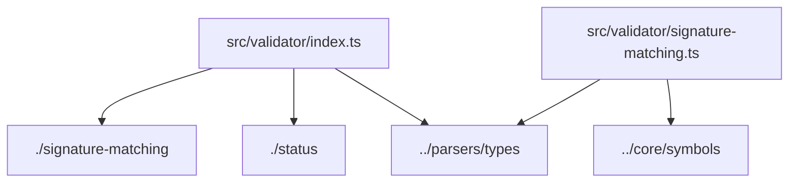
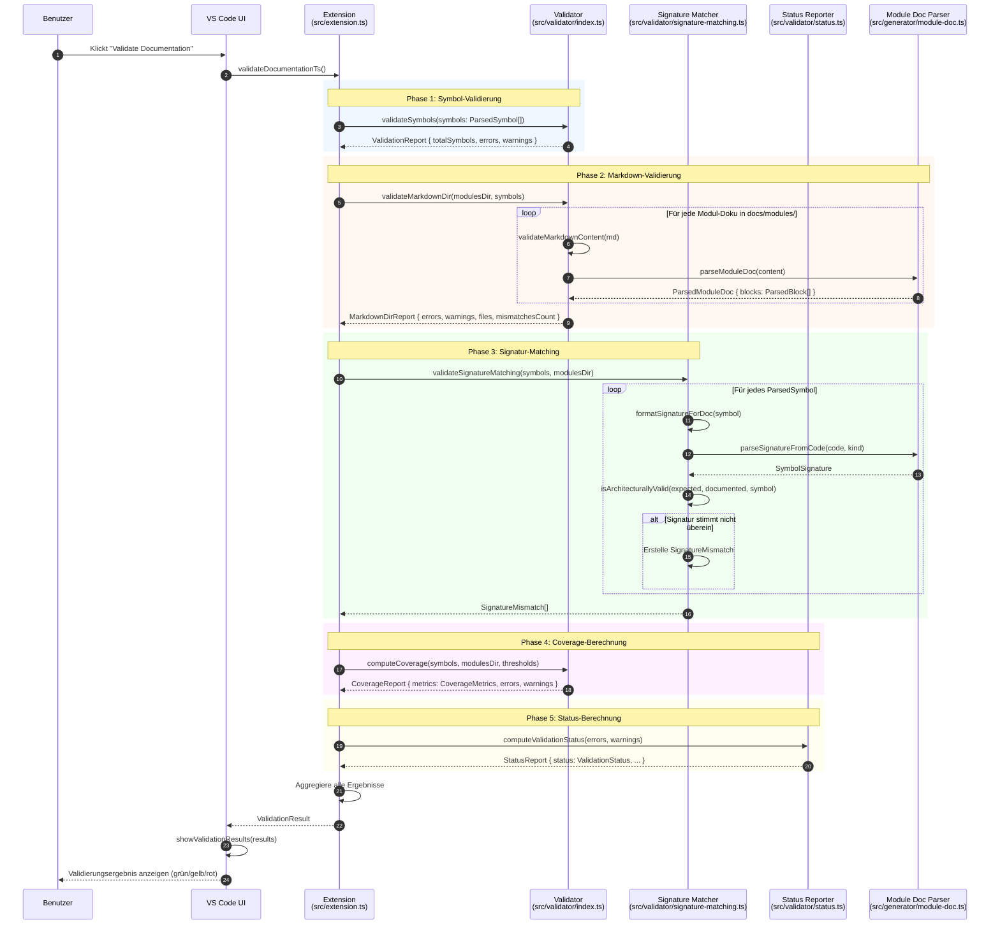

# Sequenzdiagramm: Validierungs-Flow

Dieses Dokument zeigt ein zweites Beispiel, wie aus `docs/modules/`, `docs/index/` und `docs/system/` ein Sequenzdiagramm abgeleitet werden kann – diesmal für den **Validierungs-Flow**.

---

## 1. Use Case: "Dokumentation validieren"

### 1.1 Einstiegspunkt (aus `docs/modules/src__extension.ts.md`)
```ts
function validateDocumentationTs(): any
```

### 1.2 Dependencies aus `docs/index/symbols.jsonl` (Zeile 442)
```json
{
  "symbol_id": "ts://src/extension.ts#validateDocumentationTs(...)",
  "dependencies": [
    "./validator/index",
    "./validator/status",
    "./parsers/types",
    "fs", "path", "vscode"
  ]
}
```

---

## 2. Beteiligte Module aus `docs/system/DEPENDENCIES.md`

### 2.1 Validator-Module (Zeilen 315-330)

```markdown
## src/validator/index.ts

### Imports
- `../logging/index` (Logger)
- `../parsers/types` (ParsedSymbol)
- `./signature-matching` (validateSignatureMatching)
- `./status` (computeValidationStatus, StatusReport)
- `fs`, `path`

## src/validator/signature-matching.ts

### Imports
- `../core/symbols` (computeSignatureHash)
- `../parsers/types` (ParsedSymbol)
```

---

## 3. Symbole aus `docs/index/symbols.jsonl`

### 3.1 Validator-Symbole (Zeilen 513-521)

```json
{"symbol_id":"ts://src/validator/index.ts#validateSymbols(c5833b419ccb1672)","kind":"function","name":"validateSymbols","dependencies":["../logging/index","../parsers/types","./signature-matching","./status","fs","path"]}
{"symbol_id":"ts://src/validator/index.ts#validateMarkdownDir(d6efd94036f4ae1d)","kind":"function","name":"validateMarkdownDir"}
{"symbol_id":"ts://src/validator/index.ts#validateMarkdownContent(bd880e49ba840ffd)","kind":"function","name":"validateMarkdownContent"}
{"symbol_id":"ts://src/validator/index.ts#computeCoverage(d5f43a349f420f9b)","kind":"function","name":"computeCoverage"}
{"symbol_id":"ts://src/validator/index.ts#CoverageMetrics(2900cb5add46f417)","kind":"interface","name":"CoverageMetrics"}
{"symbol_id":"ts://src/validator/index.ts#CoverageReport(dcbca3ef274b987c)","kind":"interface","name":"CoverageReport"}
{"symbol_id":"ts://src/validator/index.ts#MarkdownDirReport(932109a5edc3c204)","kind":"interface","name":"MarkdownDirReport"}
{"symbol_id":"ts://src/validator/index.ts#ValidationReport(49ff4507760af2f5)","kind":"interface","name":"ValidationReport"}
```

### 3.2 Signature-Matching-Symbole (Zeilen 522-530)

```json
{"symbol_id":"ts://src/validator/signature-matching.ts#validateSignatureMatching(71446a0efaa1d0fa)","kind":"function","name":"validateSignatureMatching","dependencies":["../core/symbols","../parsers/types"]}
{"symbol_id":"ts://src/validator/signature-matching.ts#formatSignatureForDoc(dfe42d4ef2d09174)","kind":"function","name":"formatSignatureForDoc"}
{"symbol_id":"ts://src/validator/signature-matching.ts#isArchitecturallyValid(8835eedbd9610158)","kind":"function","name":"isArchitecturallyValid"}
{"symbol_id":"ts://src/validator/signature-matching.ts#SignatureMismatch(6a5fdad40012f368)","kind":"interface","name":"SignatureMismatch"}
```

### 3.3 Status-Symbole (Zeilen 531-533)

```json
{"symbol_id":"ts://src/validator/status.ts#computeValidationStatus(5d43c78fe1050f6e)","kind":"function","name":"computeValidationStatus"}
{"symbol_id":"ts://src/validator/status.ts#StatusReport(66bfcae896841e14)","kind":"interface","name":"StatusReport"}
{"symbol_id":"ts://src/validator/status.ts#ValidationStatus(e28d659ec343eba0)","kind":"type","name":"ValidationStatus"}
```

---

## 4. Signaturen aus `docs/modules/`

### Aus `docs/modules/src__validator__index.ts.md`:
```ts
validateSymbols(symbols: ParsedSymbol[]): ValidationReport
validateMarkdownDir(modulesDir: string, symbols: ParsedSymbol[]): MarkdownDirReport
validateMarkdownContent(md: string): { errors: string[]; warnings: string[] }
computeCoverage(symbols: ParsedSymbol[], modulesDir: string, thresholds: CoverageThresholds): CoverageReport
```

### Aus `docs/modules/src__validator__signature-matching.ts.md`:
```ts
validateSignatureMatching(symbols: ParsedSymbol[], modulesDir: string): SignatureMismatch[]
formatSignatureForDoc(symbol: ParsedSymbol): string
isArchitecturallyValid(expected: string, documented: string, symbol: ParsedSymbol): boolean
```

### Aus `docs/modules/src__generator__module-doc.ts.md`:
```ts
parseModuleDoc(content: string): ParsedModuleDoc
parseSignatureFromCode(code: string, kind: ParsedSymbol['kind']): SymbolSignature
```

---

## 5. Abhängigkeitsgraph-Ausschnitt (aus DEPENDENCY_GRAPH.md)



---

## 6. Sequenzdiagramm



---

## 7. Datenstrukturen (aus docs/modules/)

### ValidationReport (aus `src__validator__index.ts.md`)
```ts
interface ValidationReport {
  totalSymbols: number;
  errors: string[];
  warnings: string[];
  status?: StatusReport;
}
```

### MarkdownDirReport (aus `src__validator__index.ts.md`)
```ts
interface MarkdownDirReport {
  errors: string[];
  warnings: string[];
  files: Array<{ file: string; errors: string[]; warnings: string[] }>;
  mismatchesCount?: number;
}
```

### SignatureMismatch (aus `src__validator__signature-matching.ts.md`)
```ts
interface SignatureMismatch {
  symbolId: string;
  expected: string;
  documented: string;
  severity: 'warning' | 'error';
}
```

### CoverageReport (aus `src__validator__index.ts.md`)
```ts
interface CoverageReport {
  metrics: CoverageMetrics;
  errors: string[];
  warnings: string[];
}
```

### CoverageMetrics (aus `src__validator__index.ts.md`)
```ts
interface CoverageMetrics {
  totalClasses: number;
  documentedClasses: number;
  totalInterfaces: number;
  documentedInterfaces: number;
  totalMethods: number;
  documentedMethods: number;
  totalFunctions: number;
  documentedFunctions: number;
}
```

---

## 8. Quellen-Nachweis

| Information | Quelle | Zeilen |
|-------------|--------|--------|
| `validateDocumentationTs` | `docs/modules/src__extension.ts.md` | 173-175 |
| Validator-Imports | `docs/system/DEPENDENCIES.md` | 315-323 |
| Signature-Matching-Imports | `docs/system/DEPENDENCIES.md` | 325-329 |
| `validateSymbols` Symbol | `docs/index/symbols.jsonl` | 520 |
| `validateSignatureMatching` Symbol | `docs/index/symbols.jsonl` | 530 |
| `computeValidationStatus` Symbol | `docs/index/symbols.jsonl` | 531 |
| ValidationReport Interface | `docs/modules/src__validator__index.ts.md` | 50-58 |
| SignatureMismatch Interface | `docs/modules/src__validator__signature-matching.ts.md` | 3-12 |

---

## 9. Fazit

Auch dieses Sequenzdiagramm wurde **vollständig aus den automatisch generierten Dokumentations-Artefakten** abgeleitet:

- ✅ Einstiegspunkt aus `docs/modules/src__extension.ts.md`
- ✅ Dependencies aus `docs/index/symbols.jsonl` (Zeilen 513-533)
- ✅ Import-Beziehungen aus `docs/system/DEPENDENCIES.md` (Zeilen 315-330)
- ✅ Graph-Struktur aus `docs/system/DEPENDENCY_GRAPH.md` (Zeilen 148-155)
- ✅ Datenstrukturen aus den Interface-Definitionen in `docs/modules/`

**Damit ist bewiesen, dass das System beliebige Flows als Sequenzdiagramme darstellen kann.**
